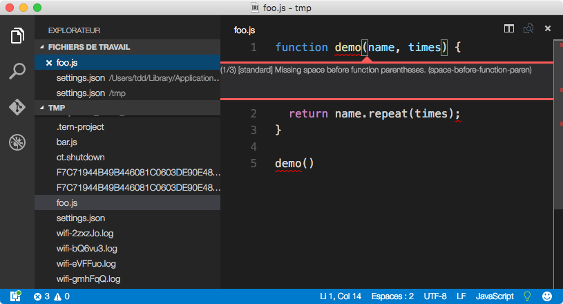
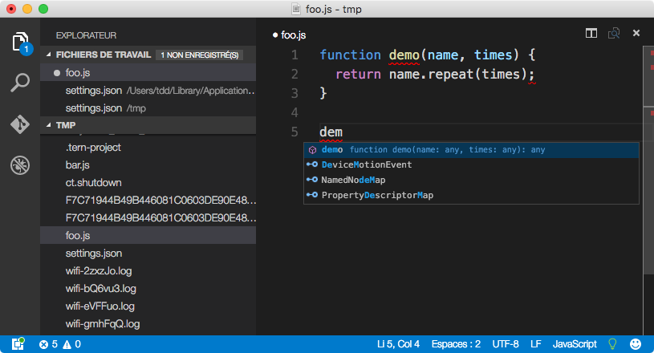

# VS Code, alors ?

Tu es sûr-e ? Pas Sublime Text ?  Bon, OK…

# Paramétrer ton Code

## Indentation et gestion du *whitespace*

Dans *Préférences > Paramètres utilisateur*, assure-toi d’avoir les réglages suivants :

```json
{
  "editor.insertSpaces": true,
  "editor.tabSize": 2,
  "editor.trimAutoWhitespace": true,
  "files.trimTrailingWhitespace": true
}
```

Il n’y a [pas encore](https://github.com/Microsoft/vscode/issues/1027) d’option pour garantir un saut de ligne en fin de fichier, mais ça pourrait venir…

## StandardJS

L’extension [standardjs](https://marketplace.visualstudio.com/items?itemName=chenxsan.vscode-standardjs) sert à ça.  Pour marcher avec de l’ES2015, pense à configurer ton `settings.json` projet comme indiqué dans la doc.

Attention, il faut que la commande `standard` soit disponible soit en global, soit dans les modules Node locaux au projet (ce sera notre cas en formation).  Il faudra ensuite redémarrer Code.



## Complétion

Code a sa propre gestion de complétion, basée sur IntelliSense, et TernJS n’y est donc pas disponible.  Elle n’est pas mal mais nécessite des bidouillages évolués pour vraiment traverser correctement les modules ES2015+, les modules Node, etc.



# Maîtriser ton Code

Code a plein de fonctionnalités fort pratiques qu’on retrouve aussi dans ST3 : curseurs multiples, intégration Git et linters, palette de commandes…  Assure-toi de [potasser les fonctionnalités clés](https://code.visualstudio.com/docs/editor/editingevolved).
