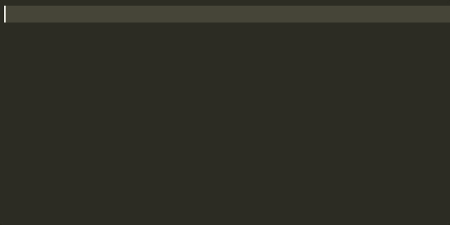
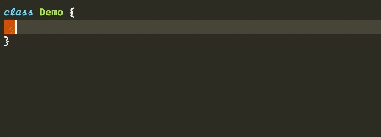
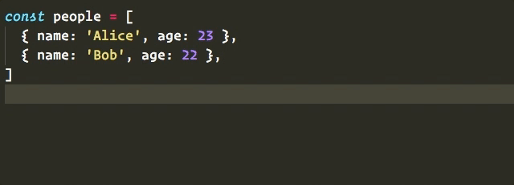
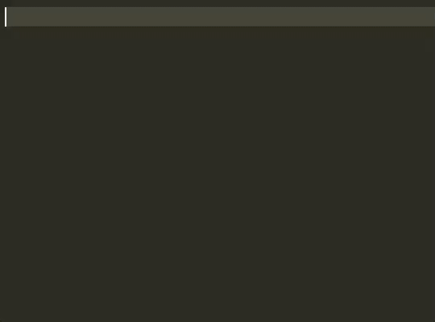
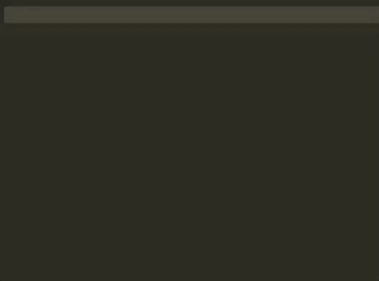
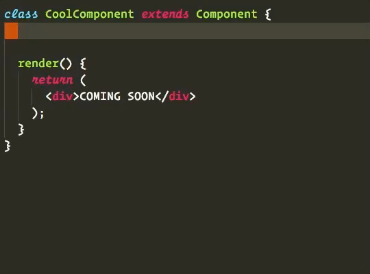

# Snippets utiles dans Visual Studio Code

Les extensions recommandées fournissent pas mal de *snippets*, des petits blocs de code associés à des raccourcis qu’on tape suivis de <kbd>Tab</kbd>.  Nous répertorions les principaux, utiles dans le cadre de nos formations, ci-dessous.

## ES2015+

### Imports

- `imp` importe l’export par défaut d’un module
- `imd` importe des exports nommés d’un module
- `ima` fait la même chose en renommant l’import localement

### Classes

- `con`	insère un constructeur vide
- `met`	insère une méthode vide

### Itérations et déstructurations

- `fof` insère une boucle `for`…`of`
- `dob`	déstructure un objet par noms de propriétés
- `dar`	déstructure un itérable

## React / JSX

### Définition de composants

- `rcc` pré-peuple un nouveau fichier de composant React basée `class`
- `rcjc` insère « juste » la définition de composant React basée `class`

- `rsc` pré-peuple un nouveau fichier de composant React fonctionnel
- `rscp` rajoute à cela la définition `propTypes`

- `con` (dans sa complétion « classConstructor ») insère un constructeur React classique
- `est` est un bon complément, qui initialise l’état local à vide (au sein d’un constructeur)

### Dans le code du composant…

- `sst` insère un appel à `this.setState` en mode « objet différentiel »
- `ssf` insère un appel à `this.setState` en mode « callback » (modifs incrémentales, etc.)

### Méthodes de cycle de vie

Au sein d’une classe de composant React, on peut facilement insérer les corps de méthodes de cycle de vie :

- `ren` insère `render`
- `cwm` insère `componentWillMount`
- `cdm` insère `componentDidMount`
- `cwr` insère `componentWillReceiveProps`
- `scu` insère `shouldComponentUpdate`
- `cwup` insère `componentWillUpdate`
- `cdup` insère `componentDidUpdate`
- `cwun` insère `componentWillUnmount`

### PropTypes

Au sein d’une définition `propTypes`, des snippets permettent d’exploiter rapidement les quelques validateurs de base fournis par le module `prop-types`.  Tous démarrent par `pt`, et la version suffixée `.isRequired` s’obtient en ajoutant un `r` final au nom du snippet.

- `pta` insère `PropTypes.array`
- `ptar` insère `PropTypes.array.isRequired`
- `ptb` insère `PropTypes.bool`
- `ptbr` insère `PropTypes.bool.isRequired`
- `ptf` insère `PropTypes.func`
- `ptfr` insère `PropTypes.func.isRequired`
- `ptn` insère `PropTypes.number`
- `ptnr` insère `PropTypes.number.isRequired`
- `pto` insère `PropTypes.object.`
- `ptor` insère `PropTypes.object.isRequired`
- `pts` insère `PropTypes.string`
- `ptsr` insère `PropTypes.string.isRequired`
- `ptnd` insère `PropTypes.node`
- `ptndr` insère `PropTypes.node.isRequired`
- `ptel` insère `PropTypes.element`
- `ptelr` insère `PropTypes.element.isRequired`
- `pti` insère `PropTypes.instanceOf(…)`
- `ptir` insère `PropTypes.instanceOf(…).isRequired`
- `pte` insère `PropTypes.oneOf([…])`
- `pter` insère `PropTypes.oneOf([…]).isRequired`
- `ptet` insère `PropTypes.oneOfType([…])`
- `ptetr` insère `PropTypes.oneOfType([…]).isRequired`
- `ptao` insère `PropTypes.arrayOf(…)`
- `ptaor` insère `PropTypes.arrayOf(…).isRequired`
- `ptoo` insère `PropTypes.objectOf(…)`
- `ptoor` insère `PropTypes.objectOf(…).isRequired`
- `ptsh` insère `PropTypes.shape({…})`
- `ptshr` insère `PropTypes.shape({…}).isRequired`
